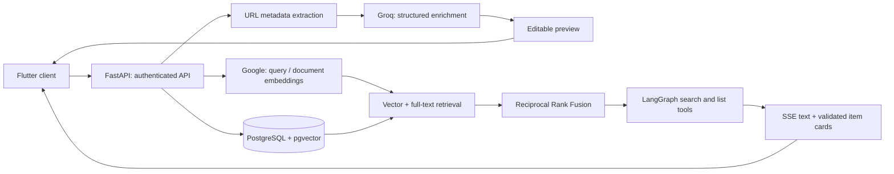

# Second Memory

[](https://github.com/ahmadnouh97/my-second-memory/actions/workflows/ci.yml)

**Save what you discover. Find it again when it matters.**

Second Memory turns a collection of saved links into a searchable personal knowledge library. It generates editable summaries and tags, combines semantic and keyword retrieval, and lets you ask a tool-using assistant about your collection.

Built with Python, FastAPI, PostgreSQL/pgvector, LangGraph, and Flutter. The app and database are self-hosted; Groq and Google AI Studio provide hosted inference.

[Quick start](#quick-start) · [Architecture](#architecture) · [Tests and evaluation](#tests-and-evaluation) · [Demo walkthrough](examples/README.md) · [Deployment](DEPLOYMENT.md)

## Features

- **Smart saving**: Paste or share any URL → AI extracts title, generates summary + tags (reusing your existing tags where they fit)
- **Tag management**: View all tags with counts; rename or delete a tag across all items in one click
- **Import / Export**: Export your entire collection to JSON or CSV; import from JSON or CSV with duplicate skipping
- **Android share intent**: Share directly from any Android app
- **Hybrid search**: Semantic (vector) + full-text search combined with RRF
- **Filter**: By tags and content type; the list API also supports dates
- **AI assistant**: Ask natural language questions and receive clickable cards resolved from authorized tool results
- **Resilient retrieval**: Fall back to keyword results when the embedding provider is unavailable
- **Account isolation**: User-scoped database queries and per-account local chat history

## Tech Stack

| Layer | Technology |
|---|---|
| Backend | Python 3.12 + FastAPI |
| Database | PostgreSQL 16 + pgvector |
| Embeddings | Google AI Studio — Gemini `gemini-embedding-001` (768-dim, API) |
| LLM | Groq API — configurable with `GROQ_MODEL` (default `openai/gpt-oss-120b`) |
| Frontend | Flutter 3.41.5 + Riverpod + go_router (Android + Web) |

## Architecture



### Engineering decisions

- **One database for retrieval and application data.** PostgreSQL handles ownership, tags, full-text search, and 768-dimensional vectors. This keeps the deployment small.
- **Rank fusion instead of score normalization.** RRF combines the two result lists using `1 / (60 + rank)`. Tag/type filters apply within both database queries before candidate limits.
- **Different embedding tasks for queries and documents.** Saved titles/summaries use `RETRIEVAL_DOCUMENT`; search queries use `RETRIEVAL_QUERY`.
- **Human review before saving.** Structured LLM output becomes an editable preview. The user controls the final title, summary, and tags.
- **Server-owned chat cards.** The model references IDs; the backend resolves fields from results retrieved for the authenticated account. Invented IDs and duplicate references are discarded.
- **Bounded blocking work.** Synchronous extraction and enrichment run in FastAPI's thread pool. Provider failures during query embedding fall back to full-text search without hiding database errors.

## Tests and evaluation

```bash
cd backend
uv sync --locked --group dev
uv run --locked pytest -q

cd ../frontend
flutter pub get --enforce-lockfile
flutter analyze
flutter test
```

Backend tests cover rank fusion, candidate filtering, provider fallback, SQL ownership/filter predicates, chat-reference validation, tool-event handling, and extraction concurrency. Flutter tests cover account-isolated persistence, fragmented UTF-8/SSE responses, rate-limit feedback, and the empty-library welcome screen. Unit tests use mocked external services; they do not measure live model quality or replace database integration tests.

The [search evaluation kit](examples/README.md) includes eight synthetic library entries, eight labeled queries, and a read-only runner that reports Recall@k, MRR@k, and median request latency from a running API. It provides a starting point for comparing retrieval changes; no live accuracy improvement is claimed without measured results.

GitHub Actions runs the test suites, Flutter analysis, and a release web build on pushes and pull requests.

## Quick Start

### 1. Configure environment

```bash
cp .env.example .env
# Edit .env and set:
#   GROQ_API_KEY=your_groq_key_here
#   GOOGLE_API_KEY=your_google_ai_studio_key_here
#   JWT_SECRET=a-long-random-secret
#   REGISTRATION_ALLOWED_EMAILS=you@example.com
```

An empty registration whitelist blocks account creation. Use your exact email for a private installation. After starting the frontend, visit `http://localhost:4200/#/register` to create that account. The login-page registration button is shown only when the whitelist is `*` (open registration).

### 2. Start the backend

```bash
docker compose up -d --build
docker compose exec backend uv run alembic upgrade head

```

For an existing collection with missing embeddings, run `docker compose exec backend uv run python scripts/reembed_all.py`. A fresh installation does not need this step.

API available at `http://localhost:8001`
Swagger docs at `http://localhost:8001/docs`

### 3. Run the web frontend

```bash
cd frontend
flutter pub get
flutter run -d chrome --web-port=4200
```

App available at `http://localhost:4200`

### 4. Android setup

```bash
cd frontend
flutter run --dart-define=BACKEND_URL=http://10.0.2.2:8001  # Android emulator

# Build release APK
flutter build apk --release
```

> **Android API URL**: Debug builds default to `http://localhost:8001`; release builds default to `https://memo-api.nouhlab.com`. Override with `BACKEND_URL` for your own deployment or a real device on the same network:
> ```bash
> flutter build apk --dart-define=BACKEND_URL=http://192.168.1.x:8001
> ```
> Plain HTTP on a real device also requires Android cleartext-traffic configuration. Native Android files are currently ignored by this repository, so the reproducible CI target is web; an Android build requires the locally configured native project.

## Current scope

Extraction is based on public metadata/descriptions; videos are not transcribed and article bodies are not currently indexed by the save UI. Chat answers use saved metadata and summaries, so item cards are references rather than passage-level evidence. English full-text analysis complements multilingual embeddings. Search can degrade to lexical retrieval, but startup and saving still depend on the embedding provider.

This is a personal deployment, not an unrestricted public URL-fetching service. The extraction and image-proxy endpoints need outbound-network restrictions before public untrusted access. See [DEPLOYMENT.md](DEPLOYMENT.md) for hosting details.

## Project Structure

```
my-second-memory/
├── docker-compose.yml
├── .env.example
├── backend/
│   ├── Dockerfile
│   ├── .dockerignore
│   ├── pyproject.toml
│   ├── alembic/              # DB migrations
│   └── app/
│       ├── main.py
│       ├── config.py
│       ├── database.py
│       ├── models/           # SQLAlchemy ORM
│       ├── schemas/          # Pydantic schemas
│       ├── repositories/     # Data access layer
│       ├── services/         # Business logic
│       │   ├── metadata_extractor.py
│       │   ├── ai_service.py
│       │   ├── embedding_service.py
│       │   └── search_service.py
│       └── routers/
│           ├── items.py      # CRUD + search
│           ├── chat.py       # AI assistant (SSE)
│           └── tags.py       # Tag listing, rename, delete
└── frontend/                 # Flutter app
    ├── lib/
    │   ├── main.dart
    │   ├── config/           # environment.dart, router.dart
    │   ├── models/           # Item, ChatMessage, Tag (Freezed)
    │   ├── services/         # api_service.dart, share_service.dart
    │   ├── providers/        # Riverpod: items_provider, chat_provider, tags_provider
    │   ├── theme/            # app_theme.dart (Material 3 dark)
    │   ├── widgets/          # item_card, filter_bar, chat_item_card, …
    │   └── pages/            # home, add_item, item_detail, chat, tags
    ├── assets/
    │   └── logo.svg          # App logo (also used as launcher icon)
    └── android/
```

## API Reference

| Method | Endpoint | Description |
|---|---|---|
| POST | `/api/items/extract` | Extract + AI-enrich URL metadata (preview) |
| POST | `/api/items` | Save item |
| GET | `/api/items` | List with filters (tags, type, date, page) |
| GET | `/api/items/search?q=...` | Hybrid search |
| GET | `/api/items/export?format=json\|csv` | Export all items as a file download |
| POST | `/api/items/import` | Import items from JSON or CSV (skips duplicates) |
| DELETE | `/api/items` | Delete all items |
| GET | `/api/items/{id}` | Get single item |
| PUT | `/api/items/{id}` | Update item |
| DELETE | `/api/items/{id}` | Delete item |
| POST | `/api/chat` | AI assistant (SSE streaming) |
| GET | `/api/proxy/image?url=...` | Image proxy (bypasses CDN CORS on web) |
| GET | `/api/tags` | List all tags with usage counts |
| PATCH | `/api/tags/{tag}` | Rename a tag across all items |
| DELETE | `/api/tags/{tag}` | Remove a tag from all items |

## Frontend Development

```bash
cd frontend

# Run on web (Chrome)
flutter run -d chrome --web-port=4200

# Run on Android emulator / connected device
flutter run

# Build release APK
flutter build apk --release

# Regenerate Freezed / JSON models after editing model files
dart run build_runner build --delete-conflicting-outputs

# Regenerate app icons after changing assets/logo.svg
dart run flutter_launcher_icons
```

## Debugging the Backend in Docker

A `docker-compose-debug.yml` override enables `debugpy` remote debugging on port `5678`.

### Start in debug mode

```bash
docker compose -f docker-compose.yml -f docker-compose-debug.yml up -d --build
```

The backend starts normally and serves requests immediately. Attach the debugger at any time.

### Attach from VS Code

Add to `.vscode/launch.json`:

```json
{
  "name": "Docker: Remote Attach",
  "type": "debugpy",
  "request": "attach",
  "connect": { "host": "localhost", "port": 5678 },
  "pathMappings": [{ "localRoot": "${workspaceFolder}/backend", "remoteRoot": "/app" }]
}
```

Then press **F5** (or Run → Start Debugging) with the `Docker: Remote Attach` config selected.

### Attach from PyCharm

Run → Edit Configurations → **+** → Python Remote Debug → host `localhost`, port `5678`, path mapping: local `<project>/backend` → remote `/app` → OK → click the debug button.

> **Note:** Hot-reload (`--reload`) is disabled in debug mode. Uvicorn's reloader forks child processes and `debugpy` only attaches to the parent, making breakpoints unreliable. Restart the container to pick up code changes.

## Changing the LLM

The backend uses LangChain. To switch from Groq to another provider:

1. Install the provider's LangChain package (e.g., `langchain-openai`)
2. Update `app/services/ai_service.py` and `app/routers/chat.py` to use the new LLM class
3. Update `.env` with the new API key

No other changes needed — the rest of the app is provider-agnostic.
