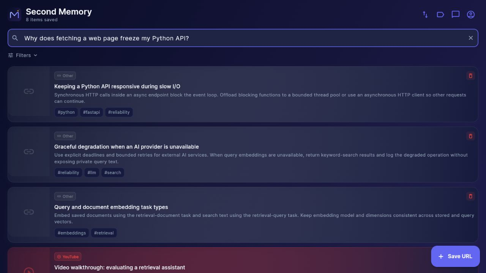
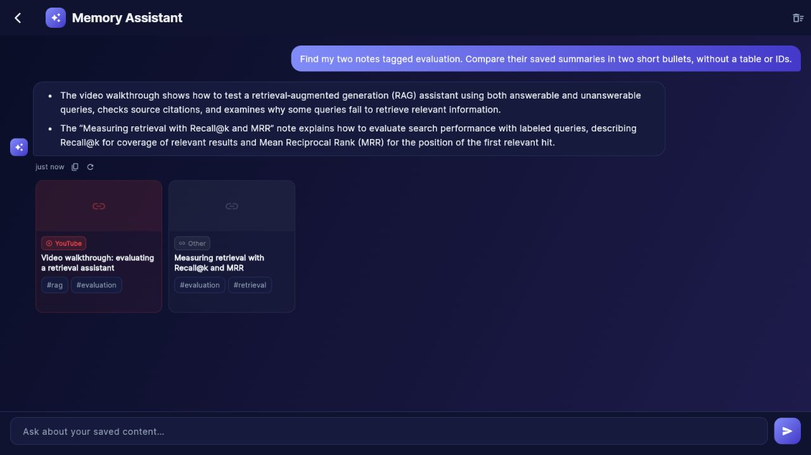

# Demo and retrieval evaluation

These eight notes are **synthetic examples**, authored for this project. Their `example.com` URLs identify fixtures and do not point to real articles or videos. Labels in `search-eval.json` are manually assigned expected results, not model-generated judgments.

## Three-minute walkthrough

1. Start the app using the root README and sign in to a dedicated test account.
2. Import `demo-library.json` using the library's JSON import action. Wait for all eight entries to import; this step calls the configured embedding API.
3. Search “Why does fetching a web page freeze my Python API?” and inspect the matching note. Try filtering “cosine similarity database” to GitHub entries.
4. Ask chat “Find my notes about evaluating retrieval.” Inspect the returned item cards, then edit a note's tags and search again.

Watch the [48-second demo video](media/walkthrough.mp4) (MP4, 1.3 MB, silent): browse the library, search with a paraphrased question, open the matching note, and ask the assistant to compare two saved notes. The assistant used the configured Groq model and returned source cards; the video also shows opening one of those sources.

We captured live browser interactions with the synthetic fixture on September 11, 2026, sampling page frames at about 8 fps and exporting a 2048 × 928 H.264 MP4 at 30 fps. We trimmed pauses between steps. The video demonstrates features; it is not a latency benchmark. The capture excludes the desktop, other tabs, and audio. The [earlier screenshot sequence](media/walkthrough.gif) remains available.





Test an unsupported question too: current prompting asks the assistant to acknowledge insufficient evidence, but abstention is not yet enforced or measured by this benchmark.

## Measured smoke run

The [complete result](results/search-2026-09-11.json) records eight queries against the eight imported notes, with no unrelated items in the test account. All eight relevant first results ranked first; all labeled relevant results appeared within the top five.

| Measurement | Result |
|---|---:|
| Recall@5 | 1.0 |
| MRR@5 | 1.0 |
| Median API latency | 324.7 ms |

Run conditions:

- September 11, 2026; backend commit `36c348d5ea1fb2ff5a28291373bbed7bd6585366`.
- Local Python 3.12 API and isolated PostgreSQL 16.13 / pgvector 0.8.2 database. All five migrations applied; all eight notes had embeddings.
- Google `gemini-embedding-001`, 768 dimensions, document/query task types; real provider requests, no mocked embeddings.
- Repository defaults: RRF constant 60, IVFFlat cosine index with 100 lists, one probe, and a GIN full-text index. The PostgreSQL planner chooses whether to use an index on this tiny corpus.
- One sequential pass after startup warmup and import; no repeated measurements or controlled cache state. Latency includes provider network time and local API/database work.
- Returned rankings include semantic matches, rather than keyword-only fallback. No service outage was injected during this run; regression tests exercise fallback separately.

The perfect score reflects a small, authored fixture. Use it as a smoke check and expand the corpus before drawing conclusions about real collections. No before/after quality improvement is claimed.

## Run the benchmark

Use a dedicated account containing only the fixture so unrelated items do not affect the comparison. Obtain that account's `access_token` through `POST /api/auth/login` in the local Swagger UI at `http://localhost:8001/docs`. Keep it out of committed files and recordings.

PowerShell, from the repository root:

```powershell
$env:SECOND_MEMORY_TOKEN = '<test-account-access-token>'
python backend/scripts/evaluate_search.py --base-url http://localhost:8001 --k 5
Remove-Item Env:SECOND_MEMORY_TOKEN
```

Bash:

```bash
export SECOND_MEMORY_TOKEN='<test-account-access-token>'
python3 backend/scripts/evaluate_search.py --base-url http://localhost:8001 --k 5
unset SECOND_MEMORY_TOKEN
```

The runner uses Python's standard library and makes authenticated **GET requests only**. It does not create accounts, import items, or modify the database. Searches call the configured embedding API and may consume quota. For a remote API, use HTTPS.

Output includes per-query returned URLs, Recall@k, reciprocal rank, latency, and aggregate Recall@k, MRR@k, and median latency. API failures stop the run with a nonzero exit code; they are not counted as successful queries. Provider fallback is logged by the server, so record whether fallback occurred when comparing runs.

## Interpret results honestly

- This is a small retrieval smoke benchmark, not a representative accuracy study. It does not measure answer faithfulness, citation support, or unanswerable queries.
- Record the commit, embedding model, database index configuration, corpus, and whether the run was cold or warm. Keep them fixed when comparing code changes.
- Review per-query failures. Expand the labels with realistic questions before making broader claims.
- Unit tests verify metric calculations with controlled rankings; the published live run above measures only this fixture.

## Resume wording supported by the implementation

Choose the angle that matches the role; add measured scale or improvements only after collecting them.

- **AI Engineer:** Built a self-hosted knowledge-curation application with FastAPI, PostgreSQL/pgvector, and Flutter, integrating structured LLM enrichment, hybrid retrieval, and a tool-using assistant.
- **LLM / RAG Engineer:** Implemented semantic and full-text retrieval with Reciprocal Rank Fusion, query/document embedding task types, provider-failure fallback, and server-validated chat references.
- **Applied ML Engineer:** Added labeled retrieval fixtures and a reproducible Recall@k/MRR evaluation runner, with regression tests for ranking, filtering, and model-provider failure behavior.
